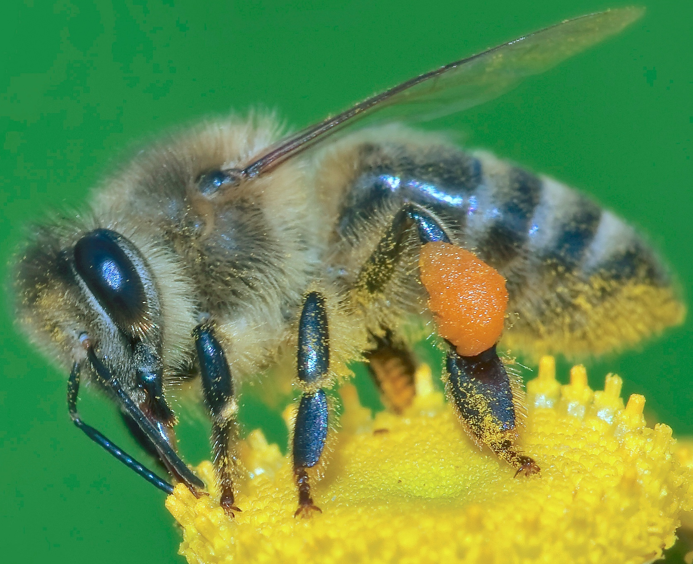

# Welcome to Lan Group

**Title:** 
  - Associate Professor of Physics
  - WeChat: yclan2014
  - Skype: yucheng.lan
  - Email: yclan2013@gmail.com
  - ORCID: 0000-0002-6737-4168
  - Web of Science ResearcherID: F-9501-2011

**Education:**
  - Ph.D. Condensed Matter Physics, Institute of Physics, Chinese Academy of Sciences, 1998
  - M.S. Solid State Physics, Department of Physics, Jilin University, 1995
  - B.S. Solid State Physics, Department of Physics, Jilin University, 1992

**Research Interests:**

Renewable energy, nanosensing, electron microscopy, X-ray crystallography, and nanomaterials / quantum materials. The main interest is to synthesize functional materials, characterize properties using diffraction / imaging / spectroscopies, investigate photon/electron / phonon transport at nanoscale, and develop their applications in thermoelectrics / photovoltaics / electrocatalytics / sensors.  

**Awards**
  - PI of DOE awards
  - co-PI of DTRA programs
  - PI of programs supported by Universities and companies
  - Subawardee of ARL and DoED projects
  - Editor of two books
  - Guest editor of two peer-reviewed journals

**Selected Publications** (Total: 140, h-Index: 44, i10-index: 96, citations: 15,000) and [Citations](https://scholar.google.com/citations?user=xtJ-O98AAAAJ&hl=en)

  - Jesse Dampare, Mobolaji Zondode, Sz-Chian Liou, Birol Ozturk, Hongtao Yu, and Yucheng Lan, EELS Investigations of Carbon-rich Boron Carbide Nanomaterials, _Microscopy & Microanalysis_ **24** (2018) 1756 – 1757.
  - Aiwu Wang, Li Fu, Chundong Wang, Winnie Wong-Ng, and Yucheng Lan, Recent Advances of Graphitic Carbon Nitride-Based Structures and Applications in Catalyst, Sensing, Imaging, and LEDs, _Nano-Micro Letters_ **9** (2017) 47-1 – 47-21
  - J. Shuai, H. Y. Geng, Y. C. Lan, Z. Zhu, C. Wang, Z. H. Liu, J. M. Bao, C. W. Chu, J. H. Sui, and Z. F. Ren, Higher thermoelectric performance of Zintl phases (Eu0.5Yb0.5)1-xCaxMg2Bi2 by band engineering and strain fluctuation, _Proceedings of the National Academy of Sciences of the United States of America_ **113** (2016) E4125 - E4132.
  - J. Shuai, H. S. Kim, Y. C. Lan, S. Chen, Y. Liu, H. Z. Zhao, J. H. Sui, and Z. F. Ren, Study on Thermoelectric Performance by Na Doping in Nanostructured Mg1-xNaxAg0.97Sb0.99, _Nano Energy_ **11** (2015) 640 - 646.
  - M. Koirala, H. Wang, M. Pokharel, Y. C. Lan, C. F. Guo, C. Opeil, and Z. F. Ren, Nanostructured YbAgCu4 for Potentially Cryogenic Thermoelectric Cooling, _Nano Letters_ **14** (2014) 5016 - 5020.
  - Y. C. Lan, Y. L. Lu, and Z. F. Ren, Mini Review on Photocatalysis of Titanium Dioxide Nanoparticles and Their Solar Applications, _Nano Energy_ **2** (2013) 1031 - 1045.
  - Y. C. Lan, Y. Wang, and Z. F. Ren, Physics and Applications of Aligned Carbon Nanotubes, _Advances in Physics_ **60** (2011) 553 - 678.
  - D. Cai, L. Ren, H. Z. Zhao, C. J. Xu, L. Zhang, Y. Yu, H. Z. Wang, Y. C. Lan, M. F. Roberts, J. Chuang, M. J. Naughton, Z. F. Ren, and T. C. Chiles, A Molecular Imprint Nanosensor for Ultrasensitive Detection of Proteins, _Nature Nanotechology_ **5** (2010) 597 - 601.
  - Y. C. Lan, B. Poudel, Y. Ma, D. Z. Wang, M. S. Dresselhaus, G. Chen, and Z. F. Ren, Structure Study of Bulk Nanograined Thermoelectric Bismuth Antimony Telluride, _Nano Letters_ **9** (2009) 1419 - 1422.
  - B. Poudel, Q. Hao, Y. Ma, Y. C. Lan, A. Minnich, B. Yu, X. Yan, D. Z. Wang, A. Muto, D. Vashaee, X. Y. Chen, J. M. Liu, M. S. Dresselhaus, G. Chen, and Z. F. Ren, High-thermoelectric Performance of Nanostructured Bismuth Antimony Telluride Bulk Alloys, _Science_ **320** (2008) 634 - 638.
